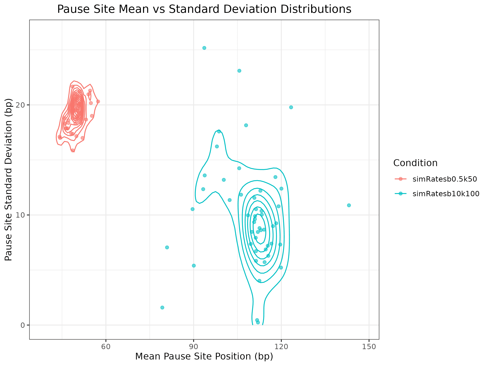
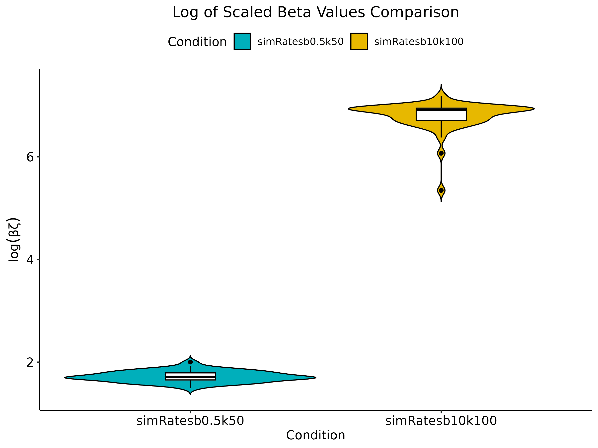

```{r setup, include = FALSE}
knitr::opts_chunk$set(
    collapse = TRUE,
    comment = "#>"
)
```

```{r load_package, include = FALSE}
# Load the package
library(STADyUM)
```

# Introduction

STADyUM is an R package for simulating and analyzing transcription dynamics.
It provides tools for:

- Simulating polymerase movement along genes
- Estimating transcription initiation, pause-release, and elongation rates
- Analyzing pause site distributions and RNAP density profiles
- Visualizing transcription dynamics across genomic regions
- Comparing transcription-associated rates under different conditions

STADyUM seamlessly integrates with the Bioconductor ecosystem by leveraging standard Bioconductor data structures such as GRanges for genomic interval handling and S4Vectors for custom Bioconductor-style data structures. This compatibility allows users to incorporate STADyUM's results directly into downstream analyses and visualization pipelines with other Bioconductor tools. 

While existing Bioconductor packages like INSPEcT focuses primarily on modeling RNA synthesis, processing, and degradation using both nascent and mature RNA-seq data through systems of differential equations, STADyUM takes a different modeling approach. STADyUM provides a probabilistic framework tailored specifically for nascent RNA data alone (such as PRO-seq, GRO-seq, 4sU-DRB-seq) including functionality for modeling steric hindrance between RNA polymerases and modeling pause-site kinetics explicitly.

# Installation

```{r install, eval = FALSE}
if (!requireNamespace("BiocManager", quietly=TRUE))
    install.packages("BiocManager")
BiocManager::install("STADyUM")
```

# Basic Usage

## Estimating Transcription Rates from Experimental Data

First estimate transcription rates from an experiment's BigWig files containing
PRO-seq read counts without steric hindrance. Uses Expectation Maximization 
algorithm to estimate transcription rates such as gene body RNAP density (chi) 
and the ratio of gene body RNAP density to pause region RNAP density under
models of fixed pause sites (betaOrg) and variable pause sites (betaAdp).

The example data used throughout this package is derived from @Aoi2020. The data is from the raw PRO-Seq read counts for human cells treated with auxin-induced acute depletion of NELF(negative elongation factor). 
Raw PRO-seq data is located at GEO: GSE144786. The raw fastq files were 
processed with https://github.com/Danko-Lab/proseq2.0. 

Estimates of transcription rates, such as chi and beta, are calculated 
given Expectation Maximization with likelihood formulas derived in *Stationary Distribution and Inference at Steady-State* section of @Siepel2022 and stated in *Inference at Steady State* section of @Zhao2023. Note that chi is 
the estimator for the average read depth, excluding the pause peak and beta 
is the estimator for the ratio of chi to the read depth in the pause peak 
region. The estimator for beta is also given for a model adapted for varying
pause sites across cells and is denoted by variable betaAdp whereas the fixed 
pause site estimate is denoted by betaOrg, refer to *Allowing for variation in pause site* section of @Zhao2023. Pause site statistics such as the mean
position of pause sites and the variance of pause sites (fkMean and fkVar) are 
also reported.


```{r estimate_experiment_rates}
load(system.file("extdata", "granges_for_read_counting_DLD1_chr21.RData", 
package = "STADyUM"))

controlRates <- estimateTranscriptionRates(system.file("extdata",
"PROseq-DLD1-aoi-NELFC_Auxin_Ctrl-SE_plus_chr21.bw", package = "STADyUM"),
system.file("extdata", "PROseq-DLD1-aoi-NELFC_Auxin_Ctrl-SE_minus_chr21.bw",
package = "STADyUM"),
    bw_pause_filtered, bw_gb_filtered, "Control")

show(controlRates)

treatedRates <- estimateTranscriptionRates(system.file("extdata",
"PROseq-DLD1-aoi-NELFC_Auxin-SE_plus_chr21.bw", package = "STADyUM"),
system.file("extdata", "PROseq-DLD1-aoi-NELFC_Auxin-SE_minus_chr21.bw", 
package = "STADyUM"),
    bw_pause_filtered, bw_gb_filtered, "Auxin Treated")

show(treatedRates)

controlRatesTbl <- rates(controlRates)

head(controlRatesTbl)
```

Plotted below is a density plot of gene-body RNAP density values of all the genes and a parity plot for verifying the model fit. The gene-body RNAP density (chi) is an estimate of the total gene-body reads / gene-body length in RNAPs per bp. This plot indicates that most genes have low RNAP density and only a minority of the genes have higher transcriptional activity. The parity plot of expected vs. actual pause site counts per gene can be used to verify that the model fit the actual data well. In this case the Pearson correlation coefficient is 0.99 indicating the model fit is strong.
## Plotting functionality for TranscriptionRates objects

```{r plot_exp_rates, fig.width=7, fig.height=5, out.width="75%"}
plotChiDistrib(controlRates, file="ChiDistributionPlot.png")

plotExpectedVsActualPauseSiteCounts(treatedRates, 
                                    file="treatedExpActPauseSites.png")
```

## Estimate Transcription Rates for Experimental Data under Steric Hindrance

Under the model of steric hindrance, additional rates are estimated such as the landing pad occupancy (phi), pause-escape rate (betaZeta), the potential 
initiation rate (alphaZeta), and omegaZeta (effective initiation rate). The 
likelihood functions differ under the model of steric hindrance and are derived in *Fitting the Steric Hindrance Model to the Data* of @Zhao2023. Note 
the omega parameter is a scaling factor.

```{r estimate_experiment_rates_steric_hindrance, eval=FALSE}
controlRatesSH <- estimateTranscriptionRates(system.file("extdata",
"PROseq-DLD1-aoi-NELFC_Auxin_Ctrl-SE_plus_chr21.bw", package = "STADyUM"),
    system.file("extdata", "PROseq-DLD1-aoi-NELFC_Auxin_Ctrl-SE_minus_chr21.bw",
    package = "STADyUM"),
    bw_pause_filtered, bw_gb_filtered, "Control", stericHindrance=TRUE, 
    omegaScale=12.3768278981277)

show(controlRatesSH)

treatedRatesSH <- estimateTranscriptionRates(
    system.file("extdata", "PROseq-DLD1-aoi-NELFC_Auxin-SE_plus_chr21.bw", 
    package = "STADyUM"),
    system.file("extdata", "PROseq-DLD1-aoi-NELFC_Auxin-SE_minus_chr21.bw",
    package = "STADyUM"),
    bw_pause_filtered, bw_gb_filtered, "Auxin Treated", stericHindrance=TRUE, 
    omegaScale=11.0318379571379)

show(treatedRatesSH)
```


## Likelihood Ratio Tests

Compare samples treated with auxin to control samples using the likelihood ratio test functionality derived in *LikelihoodRatio Tests for Differences Between Transcription Units, Conditions, or Species* section of @Siepel2022

```{r likelihood_ratio_tests}
lrt <- likelihoodRatioTest(controlRates, treatedRates)

show(lrt)
```

## Plot Results from Likelihood Ratio Tests

As expected given current literature, RNAPs tend to pause more downstream when 
NELF is absent due to Auxin treatment. As shown in the plot, the majority of 
treated genes have average pause locations of more than 100bp downstream of the TSS. Strikingly, few RNAPs could enter productive elongation after NELF 
depletion and treated samples had a signficantly lower pause-escape rate than 
the control samples exemplified by the beta violin plots.

```{r plot_lrt_results,fig.width=7,fig.height=5,out.width="75%"}

plotMeanPauseDistrib(controlRates, file="meanPauseSitesControl.png")
plotMeanPauseDistrib(treatedRates, file="meanPauseSitesTreated.png")

BetaViolinPlot(lrt, file="lrtBetaViolinPlot.png")

```

## Simulate Polymerase

![(A) Conceptual illustration of model focusing on the kinetic model for RNAP 
movement on the DNA template. (B) Graphical model representation with unobserved continuous-time Markov chain (Z) and observed read counts (X). Read counts at  each site are conditionally independent and Poisson distributed. (C) Design of SimPol simulator tracking the movement of in silico RNAPs across N-bp DNA templates in C cells, then samples the synthetic read counts based on RNAP positions. (D) Example of synthetic nascent RNA sequencing data from SimPol alongside matched real PRO-seq data from the DNAJA1 gene on chromosome 9 of the human genome](simpol_figures.png){width=75%}

Simulate read counts by running simulations of polymerase movement along the
gene at user-specified rates and gene lengths. Our simulator models the movement of RNAPs along a set of transcription units given a continuous-time Markov model. Nascent RNA sequencing read counts are then generated under steady-state conditions by sampling based on a Poisson distribution with mean equal to the simulated RNAP frequency multiplied by a user-specified sequencing depth. A graphical model representation (Figure B) with unobserved continuous-time Markov chain (Z_i) in which user-specified paramters for transcription initiation (alpha), pause-escape, and elongation (zeta) are included as well as the observed read counts (Xi). The initial model is extended to allow for variability across cells in promoter-proximal pause site locations and steric hindrance of transcription initiation from paused RNAPs (Figure C). More information on the simulator can be found in the sections *A 
simple probabilistic model for transcription initiation, promoter-proximal 
pausing, and elongation*, *SimPol Simulator*, *Generation of synthetic NRS 
data* of @Zhao2023

```{r create_simpol, fig.width=7,fig.height=5,out.width="70%",out.height="50%"}
simpol <- simulatePolymerase(k=50, ksd=25, kMin=17, kMax=200, geneLen=1950,
alpha=2, beta=0.5, zeta=2000, zetaSd=1000, zetaMin=1500, zetaMax=2500,
cellNum=100, polSize=33, addSpace=17, time=39, timesToRecord=NULL)

show(simpol)

readCounts <- readCounts(simpol)

plotCombinedCells(simpol, file="combinedCellsLollipopPlot.png")
```

This uses the same core Expectation Maximization algorithm as the experimental data, but it is able to handle the simulated data as well.

## Estimate Transcription Rates from Simulated Data

```{r estimate_simulated_rates, fig.width=7, fig.height=5, out.width="75%"}
simRates <- estimateTranscriptionRates(simpol, name="simRatesb0.5k50",
stericHindrance=TRUE)

show(simRates)
```

## Likelihood Ratio Tests for Simulated Data

Likelihood ratio tests can also be applied to simulated data. In this example, 
the simulated rates for the first simpol object is compared to the simulated 
rates from the second simpol object. As expected given the simpol parameters, 
the plots show that the second simulated rates have higher beta and higher mean
pause sites
{width=75%}
{width=75%}

```{r simulated_lrts, fig.width=7, fig.height=5, out.width="75%", eval=FALSE}

simpol2 <- simulatePolymerase(k=100, ksd=25, kMin=75, kMax=200, geneLen=1950,
alpha=2, beta=10, zeta=2000, zetaSd=1000, zetaMin=1500, zetaMax=2500,
cellNum=100, polSize=33, addSpace=17, time=30, timesToRecord=NULL)

simRates2 <- estimateTranscriptionRates(simpol2, name="simRatesb10k100",
stericHindrance=TRUE)

simLRT <- likelihoodRatioTest(simRates, simRates2)

plotPauseSiteContourMapTwoConditions(simLRT, file="simPauseSitesContourMap.png")
BetaViolinPlot(simLRT, file="simBetaViolinPlot.png")

```

## Session Info
```{r session_info}
sessionInfo()
```