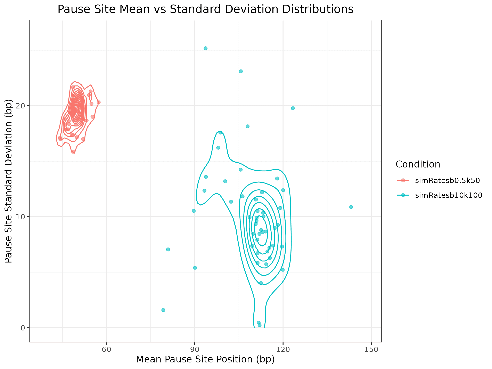
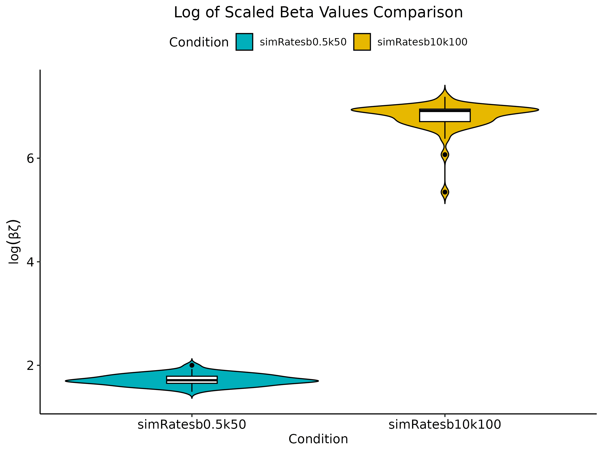

```{r setup, include = FALSE}
knitr::opts_chunk$set(
    collapse = TRUE,
    comment = "#>"
)
```

```{r load_package, include = FALSE}
# Load the package
library(STADyUM)
```

# Introduction

STADyUM is an R package for simulating and analyzing transcription dynamics.
It provides tools for:

- Simulating polymerase movement along genes
- Estimating transcription initiation, pause-release, and elongation rates
- Analyzing pause site distributions and RNAP density profiles
- Visualizing transcription dynamics across genomic regions
- Comparing transcription-associated rates under different conditions

STADyUM seamlessly integrates with the Bioconductor ecosystem by leveraging standard Bioconductor data structures such as GRanges for genomic interval handling and S4Vectors for custom Bioconductor-style data structures. This compatibility allows users to incorporate STADyUM's results directly into downstream analyses and visualization pipelines with other Bioconductor tools. 

While existing Bioconductor packages like INSPEcT focuses primarily on modeling RNA synthesis, processing, and degradation using both nascent and mature RNA-seq data through systems of differential equations, STADyUM takes a different modeling approach. STADyUM provides a probabilistic framework tailored specifically for nascent RNA data alone (such as PRO-seq, GRO-seq, 4sU-DRB-seq) including functionality for modeling steric hindrance between RNA polymerases and modeling pause-site kinetics explicitly.

The focus of this tutorial will be on using our simulator, SimPol, for simulating RNA Pol II dynamics on a DNA template. SimPol tracks the independent movement of RNAPs along the DNA templates of a large number of cells. It accepts several key user-specified parameters, including the initiation rate, pause-escape rate, a constant or variable elongation rate, the mean and variance of pause sites across cells, as well as the center-to-center spacing constraint between RNAPs, the number of cells being simulated, the gene length, and the total time of transcription. The simulator simply allows each RNAP to move forward or not, in time slices of $10^{-4}$ minutes, according to the specified position-specific rate parameters. It assumes that at most one movement of each RNAP can occur per time slice. The simulator monitors for collisions between adjacent RNAPs, prohibiting one RNAP to advance if it is at the boundary of the allowable distance from the next. After running for the specified time, SimPol outputs a `SimulatePolymerase` object that stores matrices at different time points, including the final time point, recording the RNAP positions. This is stored in slots `positionMatrices` and `finalPositionMatrix`. It also stores an estimated vector of read counts per nucleotide in slot `readCounts`.

# Installation

```{r install, eval = FALSE}
if (!requireNamespace("BiocManager", quietly=TRUE))
    install.packages("BiocManager")
BiocManager::install("STADyUM")
```

# Basic Usage

## Simulate Polymerase

![(A) Conceptual illustration of model focusing on the kinetic model for RNAP 
movement on the DNA template. (B) Graphical model representation with unobserved continuous-time Markov chain (Z) and observed read counts (X). Read counts at  each site are conditionally independent and Poisson distributed. (C) Design of SimPol simulator tracking the movement of in silico RNAPs across N-bp DNA templates in C cells, then samples the synthetic read counts based on RNAP positions. (D) Example of synthetic nascent RNA sequencing data from SimPol alongside matched real PRO-seq data from the DNAJA1 gene on chromosome 9 of the human genome](simpol_figures.png){width=75%}

Simulate read counts by running simulations of polymerase movement along the
gene at user-specified rates and gene lengths. Our simulator models the movement of RNAPs along a set of transcription units given a continuous-time Markov model. Nascent RNA sequencing read counts are then generated under steady-state conditions by sampling based on a Poisson distribution with mean equal to the simulated RNAP frequency multiplied by a user-specified sequencing depth. A graphical model representation (Figure B) with unobserved continuous-time Markov chain (Z_i) in which user-specified paramters for transcription initiation (alpha), pause-escape, and elongation (zeta) are included as well as the observed read counts (Xi). The initial model is extended to allow for variability across cells in promoter-proximal pause site locations and steric hindrance of transcription initiation from paused RNAPs (Figure C). More information on the simulator can be found in the sections *A 
simple probabilistic model for transcription initiation, promoter-proximal 
pausing, and elongation*, *SimPol Simulator*, *Generation of synthetic NRS 
data* of @Zhao2023

```{r create_simpol, fig.width=7,fig.height=5,out.width="70%",out.height="50%"}
simpol <- simulatePolymerase(k=50, ksd=25, kMin=17, kMax=200, geneLen=1950,
alpha=2, beta=0.5, zeta=2000, zetaSd=1000, zetaMin=1500, zetaMax=2500,
cellNum=100, polSize=33, addSpace=17, time=39, timesToRecord=NULL)

show(simpol)

readCounts <- readCounts(simpol)

plotCombinedCells(simpol, file="combinedCellsLollipopPlot.png")
```

Estimates of transcription rates, such as chi and beta, are calculated 
given Expectation Maximization with likelihood formulas derived in *Stationary Distribution and Inference at Steady-State* section of @Siepel2022 and stated in *Inference at Steady State* section of @Zhao2023. Note that chi is the estimator for the average read depth, excluding the pause peak and beta 
is the estimator for the ratio of chi to the read depth in the pause peak 
region. The estimator for beta is also given for a model adapted for varying
pause sites across cells and is denoted by variable betaAdp whereas the fixed 
pause site estimate is denoted by betaOrg, refer to *Allowing for variation in pause site* section of @Zhao2023.

## Estimate Transcription Rates from Simulated Data

```{r estimate_simulated_rates, fig.width=7, fig.height=5, out.width="75%"}
simRates <- estimateTranscriptionRates(simpol, name="simRatesb0.5k50",
stericHindrance=TRUE)

show(simRates)
```

## Likelihood Ratio Tests for Simulated Data

Likelihood ratio tests can also be applied to simulated data. In this example, 
the simulated rates for the first simpol object is compared to the simulated 
rates from the second simpol object. As expected given the simpol parameters, 
the plots show that the second simulated rates have higher beta and higher mean
pause sites
{width=75%}
{width=75%}

```{r simulated_lrts, fig.width=7, fig.height=5, out.width="75%", eval=FALSE}

simpol2 <- simulatePolymerase(k=100, ksd=25, kMin=75, kMax=200, geneLen=1950,
alpha=2, beta=10, zeta=2000, zetaSd=1000, zetaMin=1500, zetaMax=2500,
cellNum=100, polSize=33, addSpace=17, time=30, timesToRecord=NULL)

simRates2 <- estimateTranscriptionRates(simpol2, name="simRatesb10k100",
stericHindrance=TRUE)

simLRT <- likelihoodRatioTest(simRates, simRates2)

plotPauseSiteContourMapTwoConditions(simLRT, file="simPauseSitesContourMap.png")
BetaViolinPlot(simLRT, file="simBetaViolinPlot.png")

```

## Session Info
```{r session_info}
sessionInfo()
```